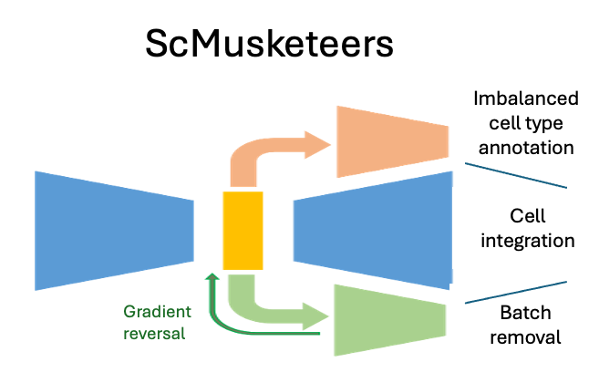

# scMusketeers : A tri-partite modular autoencoder for addressing imbalanced cell type annotation and batch effect reduction

  
 
[](https://pypi.org/project/sc-musketeers/)
[](https://anaconda.org/bioconda/sc-musketeers)
[](https://biocontainers.pro/tools/sc-musketeers)
[](https://biocontainers.pro/tools/sc-musketeers)


[](https://sc-musketeers.readthedocs.io/en/latest/?badge=latest)


## Summary

We developed scMusketeer, a modular deep learning model producing an optimal dimension-reduced representation with a focus on imbalanced cell type annotation and batch effect reduction. The architecture of scMusketeers is made of three modules. The first module is an autoencoder which provides a reduced latent representation, while removing noise, thus resulting in a better data reconstruction. The second module, is a classifier with a focal loss providing higher prediction for smaller populations of cell types. The third module is an adversarial domain adaptation (DANN) module that corrects batch effect.

scMusketeers performance was optimized after conducting a precise ablation study to assess model's hyperparameters. The model was compared to reference tools for single-cell integration and annotation. It was at least on par with state-of-the-art models, often outperforming most of them. It showed increased performance on the identification of rare cell types. Despite the rather simple structure of its deep learning model, it demonstrated equivalent performance to UCE foundation model. Finally, scMusketeers was able to transfer the cell label from single-cell RNA-Seq to spatial transcriptomics. 

Our tripartite modular autoencoder demonstrates versatile capabilities while addressing key challenges in single-cell atlas reconstruction. We noticed in particular that the generic modular framework of scMusketeers should be easily generalized to other large-scale biology projects that require deep learning models.


## Publication

scMusketeers: Addressing imbalanced cell type annotation and batch effect reduction with a modular autoencoder
Antoine C., Pelletier S., Fierville M., Droit A., Precioso F., Bécavin C., Barbry P.
[BioRXiv](https://www.biorxiv.org/content/10.1101/2024.12.15.628538v1)


## Tutorial

[Access to the tutorial on Google collab](https://colab.research.google.com/github/AntoineCollin/scMusketeers/blob/main/tutorial/scMusketeers-tutorial_deprez_lung.ipynb)

We will see in this tutorial two use-cases:
- Transfer cell annotation to unlabeled cells
- Transfer cell annotation and reduce batch from a query atlas to a reference atlas 

## Install

You can install sc_musketeers with Pypi:

```bash
$ pip install sc-musketeers
```
with conda

```bash
$ conda -c bioconda sc-musketeers
```

with docker

```bash
$ docker pull quay.io/biocontainers/sc-musketeers:0.4.1--pyhdfd78af_0
```

with singularity

```bash
$ singularity run https://depot.galaxyproject.org/singularity/sc-musketeers:0.3.7--pyhdfd78af_0
```

## Examples

sc-musketeers can be used for different task in integration and annotation of single-cell atlas. 

Here are 2 different examples:

- Transfer cell annotation to unlabeled cells

```bash
$ sc-musketeers transfer my_atlas --class_key celltype --batch_key donor --unlabeled_category=Unknown
```

- Transfer cell annotation and reduce batch from a query atlas to a reference atlas 

```bash
$ sc-musketeers transfer ref_dataset --query_path query_dataset --class_key=celltype --batch_key donor --unlabeled_category=Unknown
```


Read the [CONTRIBUTING.md](docs/contributing.md) file.
